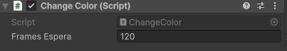
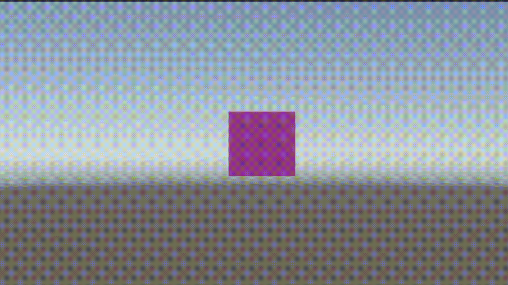
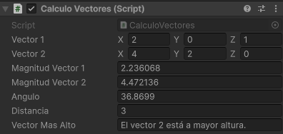
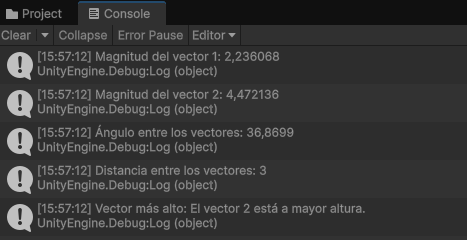
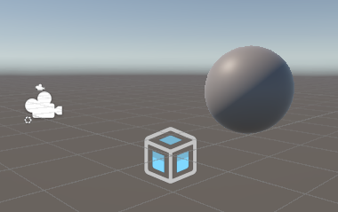
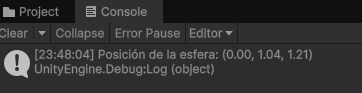
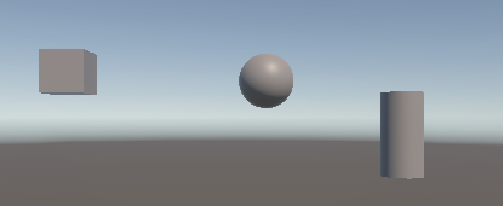
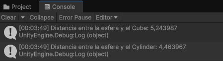

# Practica 1 Interfaces Inteligentes: Scripts de Movimiento

## Ejercicio 1: Change Color

Para este ejercicio se pide crear un script para un objeto de un cubo, el cual mediante un vector de tres numeros entre 0 y 1 se asigne el color de este cubo, utilizando para ello el sistema de colores RGB, la clase Vector3 para el vector de valores y la clase Color para representar el color en el Cubo.
Por otro lado, para mostrar el valor de los frames necesarios para el cambio de color por el inspector se puso la variable de frames de espera en publico para que se muestre en el inspector.

También se utilizaron tanto la clase Random para poder obtener esa aleatoriedad dada para obtener el nuevo color del cubo, como la aplicación de la función `GetComponent<Renderer>().material.color` para aplicar ese nuevo color.

### Resultado a 120 Frames

## Ejercicio 2: Calculo de Vectores

Para este segundo ejercicio se profundizó más en la utilización de la clase Vector3 y los métodos que podemos utilizar de esa clase para el calculo de diferentes valores como puede ser en este caso:

- La magnitud `magnitudVector1 = vector1.magnitude;`.
- Ángulo entre vectores `angulo = Vector3.Angle(vector1, vector2);`.
- Distancia entre vectores `distancia = Vector3.Distance(vector1, vector2);`.

Además de poner como publico todos los atributos que añadimos en nuestro script asi son visibles en el inspector.

## Ejercicio 3: Posición de la esfera.

Este ejercicio se centrará más en conocer como cada GameObject de Unity tiene un componente Transform, en las podemos obtener diferente información entre la que se encuentra la que queremos conocer en este ejercicio, su posición.
- En el script de este ejercicio se utiliza `transform.position` ya que Unity nos permite utilizar esta función directamente.
- Pero tambien podriamos utilizar `GetComponent<Transform>().position`.

## Ejercicio 4: Distancia Cubo/Cilindro

Para este último ejercicio se busca acceder a la posición de un GameObject al igual que el ejercicio anterior, sin embargo, nos encontramos con la peculiaridad de que hay que encontrar la posición de un GameObject el cual nos es el mismo al que está asociado el script con es en este caso la esfera.

Para ello debemos utilizar un tag en el objeto al que queremos acceder para poder llegar a el mediante un `Game.Object.FindWithTag("blue:sphere");` siendo el tag el que pongamos entre las comillas dobles como se ha realizado en este script.

